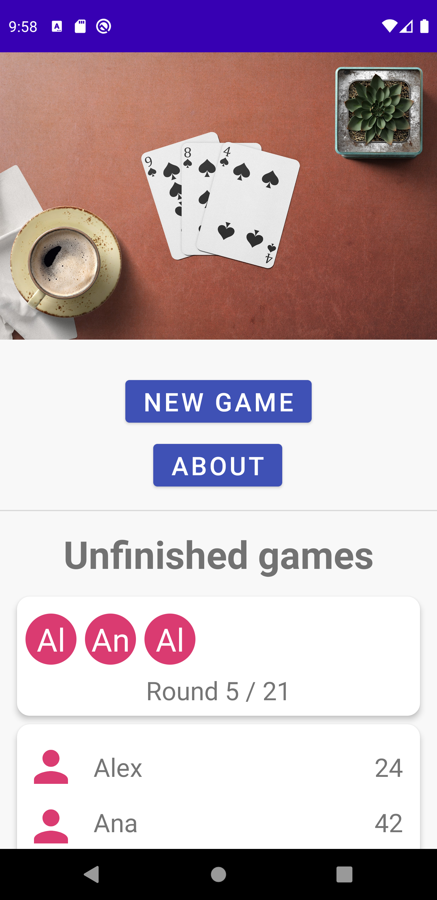
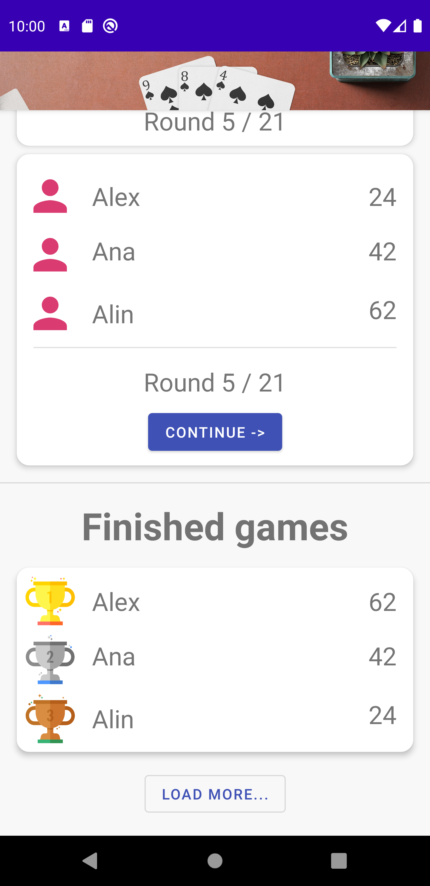
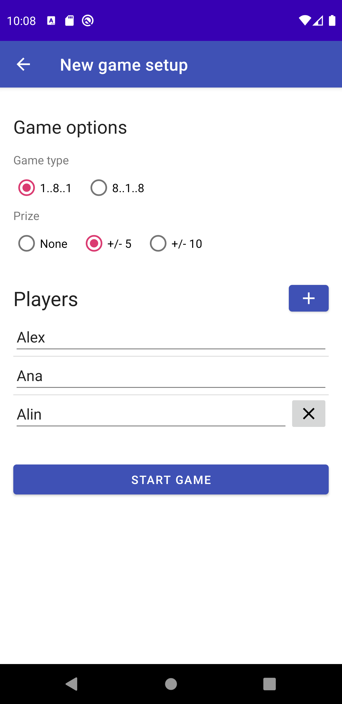
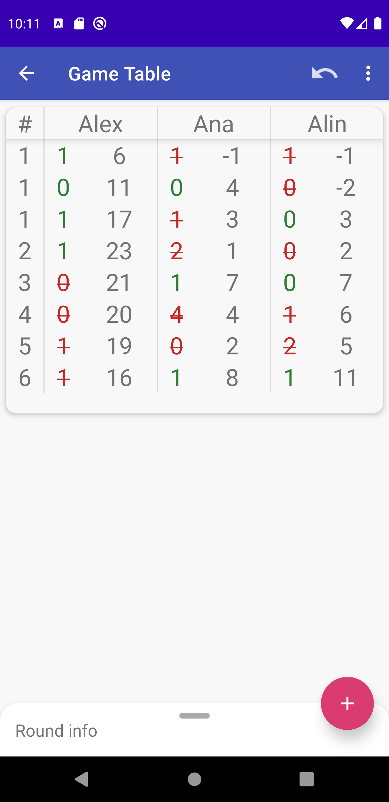
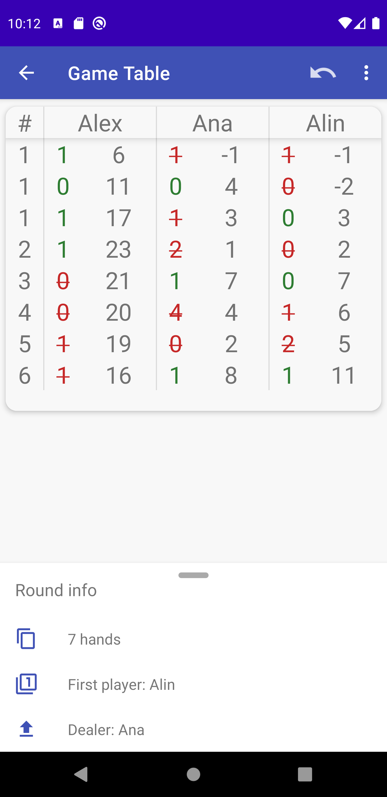
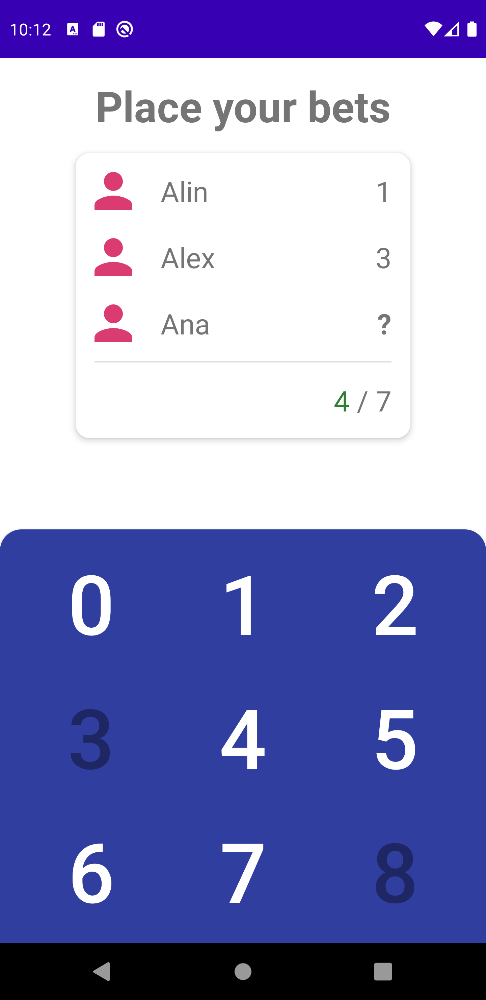

# Whist Score Tracker

This is an Android application that can track a game of [whist](https://en.wikipedia.org/wiki/Romanian_whist). It is a project that I made for fun. I enjoy playing the game and I wanted to be able to play without having paper and a pen with me and to practice my Android skills.

### Screenshots

This is still in development, so this design is not yet merged to master and the history of games is not there yet, but this is how the app will look soon:

  
  

### How to run

The latest version of the app can be run by cloning the repo and opening it in Android Studio or you can download one of compiled apks from the Releases page.
